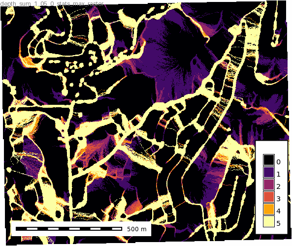
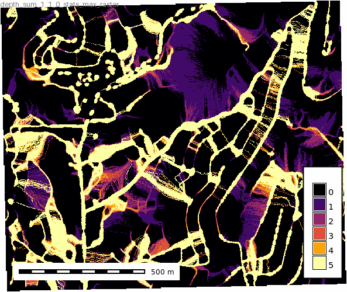
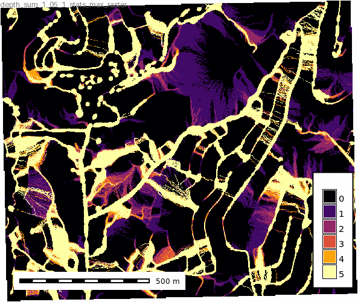

File labeling structure

`{site_name}_{depth|disch}_{resolution}_{particle density}_{seed}`

## Mean Value

The mean value shows the smoothed result of taking the mean output from 10 model runs. This in practice multiplies the number of particles used by 10 times.

### Mean Depth

::: {.grid}

::: {.g-col-6}

*Output Step 5 min*
:::

::: {.g-col-6}

*Output Step 10 min*
:::

::: {.g-col-6}

*Output Step 15 min*
:::

::: {.g-col-6}

*Output Step 25 min*
:::

::: {.g-col-6}

*Output Step 30 min*
:::

:::

### Mean Discharge

::: {.grid}

::: {.g-col-6}

*Output Step 5 min*
:::

::: {.g-col-6}

*Output Step 10 min*
:::

::: {.g-col-6}

*Output Step 15 min*
:::

::: {.g-col-6}

*Output Step 25 min*
:::

::: {.g-col-6}

*Output Step 30 min*
:::

:::

## Median Value

The median smoothed results of taking the median output from 10 model runs. This in practice multiplies the number of particles used by 10 times.

::: {.grid}

::: {.g-col-6}

*Output Step 5 min*
:::

::: {.g-col-6}

*Output Step 10 min*
:::

::: {.g-col-6}

*Output Step 15 min*
:::

::: {.g-col-6}

*Output Step 25 min*
:::

::: {.g-col-6}

*Output Step 30 min*
:::

:::

## Maximum Value

### Max Depth

::: {.grid}

::: {.g-col-6}

*Output Step 5 min*
:::

::: {.g-col-6}

*Output Step 10 min*
:::

::: {.g-col-6}

*Output Step 15 min*
:::

::: {.g-col-6}

*Output Step 25 min*
:::

::: {.g-col-6}

*Output Step 30 min*
:::

:::

### Max Discharge

::: {.grid}

::: {.g-col-6}

*Output Step 5 min*
:::

::: {.g-col-6}

*Output Step 10 min*
:::

::: {.g-col-6}

*Output Step 15 min*
:::

::: {.g-col-6}

*Output Step 20 min*
:::

::: {.g-col-6}

*Output Step 25 min*
:::

::: {.g-col-6}

*Output Step 30 min*
:::

:::

## Minimum

::: {.grid}

::: {.g-col-6}

*Output Step 5 min*
:::

::: {.g-col-6}

*Output Step 10 min*
:::

::: {.g-col-6}

*Output Step 15 min*
:::

::: {.g-col-6}

*Output Step 25 min*
:::

::: {.g-col-6}

*Output Step 30 min*
:::

:::

## Range

::: {.grid}

::: {.g-col-6}

*Output Step 5 min*
:::

::: {.g-col-6}

*Output Step 10 min*
:::

::: {.g-col-6}

*Output Step 15 min*
:::

::: {.g-col-6}

*Output Step 25 min*
:::

::: {.g-col-6}

*Output Step 30 min*
:::

:::

## Standard Deviation

::: {.grid}

::: {.g-col-6}

*Output Step 5 min*
:::

::: {.g-col-6}

*Output Step 10 min*
:::

::: {.g-col-6}

*Output Step 15 min*
:::

::: {.g-col-6}

*Output Step 25 min*
:::

::: {.g-col-6}

*Output Step 30 min*
:::

:::

## Max Raster

These visualizations represent each walkers vairablilty due to SIMWEs use of the gaussian path sampling method for particles.
Each color represents the output raster that contained the maximum values for the cell.

All simulatation are run at $1 m$ resolution:

<!-- ### 1_*_*_stats

 -->

### 10 Seeds

In this figure the output maximum depth rasters were created using `r.series` filtering the data based on the scheme `1_1_*`
where 1 represents `1` meter spatial resolution, the particle density is `1`, so the number of paritcles is equal to the number of cells, and `*` is a wildcard for the seed that was used when executing `r.sim.water`.

*Maximum Depth Output Variablity via Gaussian Path Sampling*

### Variablility based on Particle Density

Here the the outputs are all from the same seed with varibale particle density (`1_*_1`)

